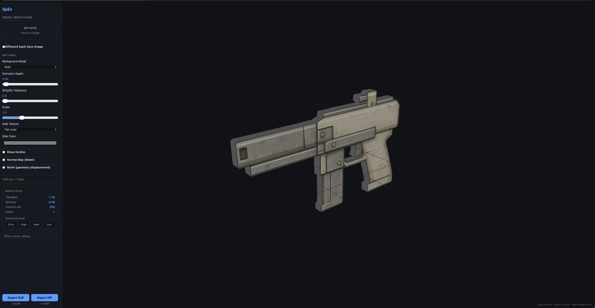
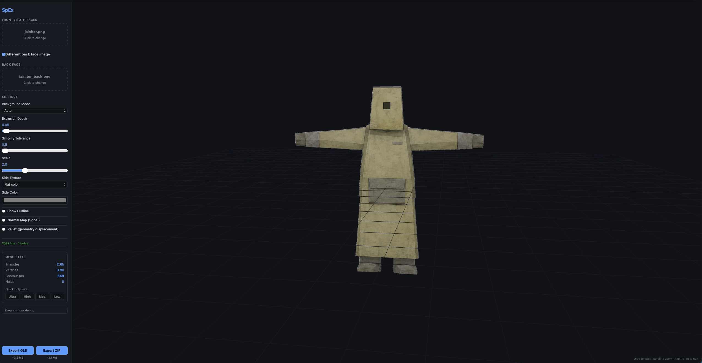
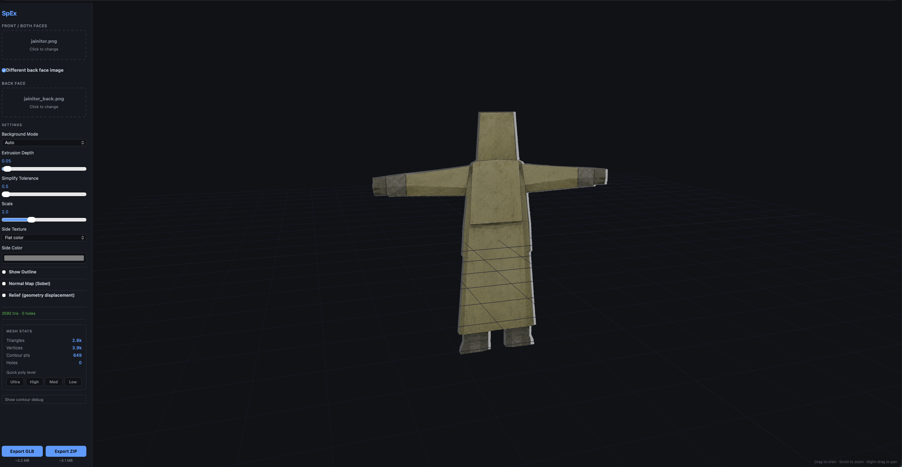

# SpEx: Sprite Extruder

> **Vibecoded** — born from vibes, caffeine, and a stubborn refusal to touch Blender.

Drop a PNG sprite, get a 3D model. That's it.

SpEx takes any sprite image and extrudes it into a proper low-poly 3D mesh — silhouette traced, holes punched through (trigger guards, donut holes, whatever), texture baked onto the faces, and ready to export as GLB or OBJ.

---

## Examples

| Gun sprite | Character (front) | Character (back face) |
|---|---|---|
|  |  |  |

---

## What it does

- **Silhouette extraction** — OpenCV.js traces the outer contour and any interior holes automatically
- **Extrusion** — earcut triangulates the 2D shape, meshBuilder pushes it into 3D
- **Texture mapping** — the original sprite pixel-perfect on front and back, projected on the sides too
- **Box face builder** — build a 6-panel box directly from face images (great for buildings/props)
- **Atlas mapper** — assign one atlas image to front/back/left/right/top/bottom tiles
- **Face editor + weld** — per-face offsets plus weld mode to keep edges closed and avoid panel gaps
- **Gap fill modes (box mode)** — fill transparent texels with `edge-stretch`, `flat-color`, or keep transparent
- **360° lathe mode** — revolve a profile into a closed radial mesh
- **Normal maps** — optional Sobel procedural normal map for depth without extra geometry
- **Outline rendering** — optional wireframe-style outline overlay
- **Rigger (WIP)** — Mixamo-style marker placement, auto skinning, and built-in animation preview
- **Export** — GLB (self-contained, textures embedded) or OBJ+MTL+PNG (classic triple-file)
- **LOD presets** — Ultra / High / Med / Low poly switches, sliders untouched

## Stack

- [Next.js 14](https://nextjs.org) — framework
- [Three.js](https://threejs.org) — rendering, materials, exporters
- [OpenCV.js](https://docs.opencv.org/4.x/d5/d10/tutorial_js_root.html) — contour extraction via CDN
- [earcut](https://github.com/mapbox/earcut) — 2D polygon triangulation with hole support
- TypeScript throughout

## Run locally

```bash
cd js
npm install
npm run dev
```

Open [http://localhost:3000](http://localhost:3000).

> OpenCV.js loads from the official CDN on first visit (~8 MB). First processing run waits for init (~2–5 s).

## Usage

1. Upload a PNG (transparent background works best, white background also supported)
2. Choose **Face Mode** (`front`, `front-back`, `front-back-lr`, `front-back-lrtb`)
3. Choose **One image** (atlas) or **Per face** uploads
4. For box workflows, enable **Box Mode** and tune **Gap Fill Mode**
5. Adjust **Extrusion Depth**, **Simplify Tolerance**, **Scale** to taste
6. Use **LOD presets** in the stats panel to quickly switch poly density
7. Toggle **Outline**, **Normal Map**, and/or **Relief** for extra detail
8. Optional: open **Rigger (WIP)**, place markers, **Build Rig**, then preview animations (`walk`, `run`, `idle`, `wave`)
9. Hit **Export GLB** (for game engines, Sketchfab, etc.) or **Export OBJ** (for anything else)

## Export formats

| Format | Textures | Notes |
|--------|----------|-------|
| GLB | Embedded | Single file, works everywhere |
| OBJ | Separate PNG + MTL | Classic, imports into most 3D software |

### Unity import

Use [**GLTFast**](https://github.com/atteneder/glTFast) to import GLB files into Unity with full PBR texture support:

```
Window → Package Manager → Add by name:
com.unity.cloud.gltfast
```

Then drag the `.glb` into your Assets folder — mesh, materials, and all texture maps import automatically.

## Settings

| Setting | Effect |
|---------|--------|
| Background Mode | `auto` detects alpha vs white. Force if wrong. |
| Face Mode | Controls how many model faces are generated and textured. |
| Extrusion Depth | Thickness of the 3D solid |
| Simplify Tolerance | Higher = fewer verts = blockier silhouette |
| Scale | World-space size of the model |
| Box Mode | Uses 6 flat panels from face images instead of silhouette extrusion. |
| Side Texture | Side-face shading mode (`image`, `edge`, `flat`). |
| Gap Fill Mode (box) | How transparent texels are filled: `edge-stretch`, `flat-color`, or keep transparent. |
| Gap Fill Color (box) | Color used when `Gap Fill Mode = flat-color`. |
| Weld Faces (Face Editor) | Keeps adjacent box panels connected while pushing/pulling face planes. |
| Face Offsets (Face Editor) | Per-face translation/depth controls to align or stylize panels. |
| Normal Map (Sobel) | Procedural normal map from image luminance |
| Relief | Real geometry displacement from texture luminance. |
| Outline | Renders a line overlay tracing the silhouette |
| Rigger (WIP) | Adds a skeleton + skinning and enables animation previews. |

---

*SpEx — because sprites deserve a third dimension.*
